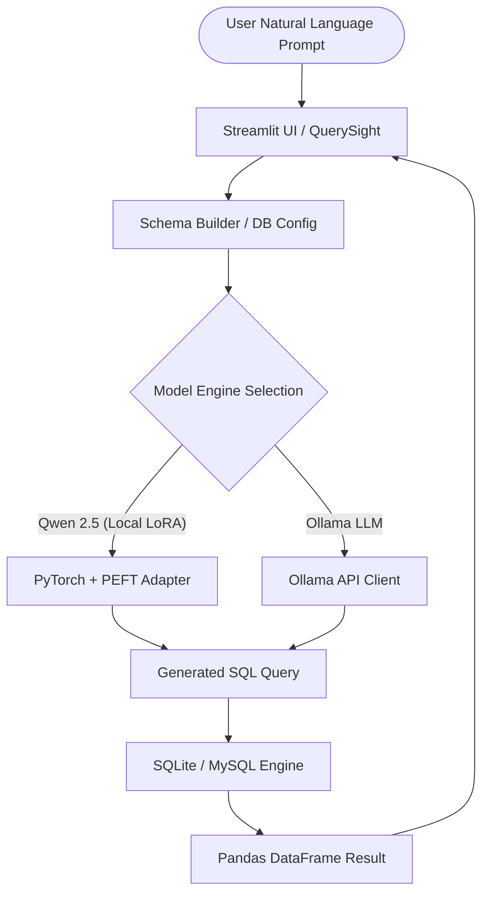

# 🔍 QuerySight: Natural Language SQL Analytics Engine

[](https://www.python.org/)
[](https://streamlit.io/)
[](https://pytorch.org/)
[](https://huggingface.co/)
[](https://ollama.ai/)
[](LICENSE)

**QuerySight** is an AI-powered text-to-SQL analytics platform designed to bridge the gap between natural language questions and relational databases. By leveraging fine-tuned local Large Language Models (Qwen2.5-3B & TinyLlama with LoRA adapters) as well as Ollama integration, QuerySight translates plain English queries into precise executable SQL and returns instant interactive data insights.

---

## 📌 Problem Statement

Non-technical business stakeholders and data analysts frequently need quick insights from relational databases but face friction writing complex SQL queries. Existing cloud-based AI solutions often pose privacy concerns by exposing database schemas and sensitive queries to third-party APIs. 

**QuerySight** solves this by providing:
- **Local & Private Execution**: Run fine-tuned text-to-SQL models on-device using Hugging Face Transformers + PEFT or Ollama.
- **Dynamic Schema Intelligence**: Interactive Schema Builder allowing users to define custom tables, data types, and primary keys on the fly.
- **Instant Insights**: Automatic execution of generated SQL queries against local SQLite or remote MySQL databases with structured data grid rendering.

---

## 📊 Dataset & Model Fine-Tuning

The specialized text-to-SQL models in QuerySight were fine-tuned using Parameter-Efficient Fine-Tuning (PEFT) with **LoRA** (Low-Rank Adaptation) on domain text-to-SQL datasets.

- **Base Architectures**: `Qwen/Qwen2.5-3B` & `TinyLlama`
- **Fine-Tuning Notebooks**:
  - [`fine_tune_qwen_text_to_sql.ipynb`](file:///c:/Users/Naman/Documents/PROJECTS/nl_sql_analytics_engine/notebooks/fine_tune_qwen_text_to_sql.ipynb)
  - [`fine_tune_tinyllama_text_to_sql.ipynb`](file:///c:/Users/Naman/Documents/PROJECTS/nl_sql_analytics_engine/notebooks/fine_tune_tinyllama_text_to_sql.ipynb)
- **Saved Adapters**: Stored locally in `models/qwen_adapters` and `models/tinyllama_adapters`.

---

## ⚙️ Methodology & Architecture

QuerySight combines an interactive web interface with a dual-engine LLM pipeline and dynamic database execution.

### System Pipeline



---

## ⚙️ Model Details & Hyperparameters

- **Prompting Format**: ChatML structure with strict schema injection.
- **Generation Parameters**:
  - `max_new_tokens`: 150
  - `temperature`: 0.1
  - `top_p`: 0.9
  - `do_sample`: True
- **HuggingFace Hub Export**: Model adapters can be merged with base weights and published using [`hf_push.py`](file:///c:/Users/Naman/Documents/PROJECTS/nl_sql_analytics_engine/hf_push.py).

---

## 📈 Results

Model fine-tuning evaluation and training loss metrics are documented inside the respective Jupyter notebooks under [`notebooks/`](file:///c:/Users/Naman/Documents/PROJECTS/nl_sql_analytics_engine/notebooks/). Detailed benchmark evaluation runs can be generated via notebook execution logs.

---

## 📁 Project Structure

```
nl_sql_analytics_engine/
├── app/
│   ├── core/
│   │   ├── llm.py          # Ollama LLM integration engine
│   │   └── sql_gen.py      # Qwen2.5-3B + LoRA adapter inference pipeline
│   ├── db/
│   │   └── sqlite_db.py    # SQLite database connection & execution wrapper
│   ├── schemas/
│   │   ├── query_req.py    # Pydantic schemas for requests and logs
│   │   └── table.py        # Pydantic schemas for table & column metadata
│   ├── ui/
│   │   ├── chat.py         # Main Chat interface & Schema Builder component
│   │   └── sidebar.py      # Database connection & generator control panel
│   ├── __init__.py
│   └── main.py             # Streamlit application entry point
├── data/
│   └── querysight.db       # Default SQLite database instance
├── models/
│   ├── qwen_adapters/      # Fine-tuned Qwen 2.5 LoRA weight adapters
│   └── tinyllama_adapters/ # Fine-tuned TinyLlama LoRA weight adapters
├── notebooks/
│   ├── fine_tune_qwen_text_to_sql.ipynb       # Fine-tuning workflow for Qwen 2.5
│   └── fine_tune_tinyllama_text_to_sql.ipynb  # Fine-tuning workflow for TinyLlama
├── personal/
│   └── helper.md           # Quick start execution helper
├── .env                    # Environment configuration file
├── hf_push.py              # Script to merge LoRA adapters & push to HuggingFace Hub
├── requirements.txt        # Python package dependencies
└── README.md               # Project documentation
```

---

## 🚀 Installation & Setup

### 1. Prerequisites
- Python 3.10+
- PyTorch (CUDA recommended for local model inference)
- Optional: [Ollama](https://ollama.ai/) installed and running locally.

### 2. Clone Repository & Setup Environment
```bash
git clone https://github.com/Naman-jain7/nl-sql-analytics-engine.git
cd nl_sql_analytics_engine
python -m venv .venv
# Windows (PowerShell)
.venv\Scripts\Activate.ps1
# Linux/macOS
source .venv/bin/activate
```

### 3. Install Dependencies
```bash
pip install -r requirements.txt
```

### 4. Configure Environment Variables
Create or verify your `.env` file in the root directory:
```env
LLM_MODEL_NAME='gemma3:4b'
MODEL_ID='Qwen/Qwen2.5-3B'
ADAPTER_PATH='models/qwen_adapters'
DATA_DIR='data/querysight.db'
MYSQL_HOST=localhost
MYSQL_USER=root
MYSQL_PORT=3306
```

---

## 💻 Usage

To launch the QuerySight web application, run the Streamlit command:

```bash
streamlit run app/main.py
```

### Workflow Steps:
1. Open the application in your browser (default: `http://localhost:8501`).
2. **Define Schema**: Expand the **🛠️ Schema Builder** to create your database tables and columns, or connect to your local SQLite/MySQL database via the **Control Panel** sidebar.
3. **Select Generator**: Choose between **Qwen 2.5 (Local LoRA)** or **Ollama** in the sidebar model options.
4. **Query Data**: Ask natural language questions in the chat box (e.g., *"Show total sales by product category"*).
5. **View Results**: Inspect the generated SQL code alongside executed tabular results.

---

## 🔮 Future Work

- **Automated Visualizations**: Integration of automated chart generation (e.g., Plotly / Altair) based on returned SQL query results.
- **Complex Schema Joining**: Enhanced multi-table relationship inference and foreign key constraint resolution.
- **Expanded DB Engines**: Support for PostgreSQL, BigQuery, and Snowflake database connectors.

---

## 🛠️ Tech Stack

- **Frontend / UI**: [Streamlit](https://streamlit.io/), Vanilla CSS (Gradients & Glassmorphism)
- **Machine Learning & NLP**: [PyTorch](https://pytorch.org/), [Hugging Face Transformers](https://huggingface.co/docs/transformers), [PEFT (LoRA)](https://github.com/huggingface/peft), [Ollama](https://ollama.ai/)
- **Data Engineering**: [Pandas](https://pandas.pydata.org/), [SQLAlchemy](https://www.sqlalchemy.org/), [Pydantic](https://docs.pydantic.dev/)
- **Utilities**: Loguru, python-dotenv, LangChain Community
